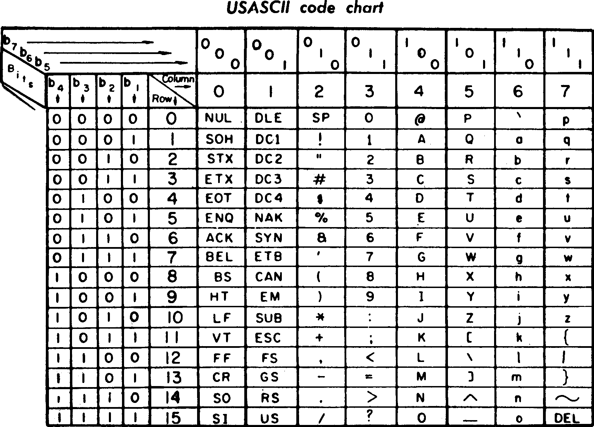

--- 
title: "Hands-on Guide to Cryptography"
---

# ASCII Encoding


Examples:

- 'a' = (61)16 = (0110 0001)2
- 'A' = (41)16 = (0100 0001)2

Properties of the ASCII encoding:
- If x is (the ASCII code of) a lower case letter, then x+' ' is the (the ASCII code of) the corresponding upper case letter.  For instance, 'a'+' ' = 'A', 'b'+' ' = 'B', ...
- Dually, if x is (the ASCII code of) an upper case letter, then x+' ' is the (the ASCII code of) the corresponding lower case letter.  For instance, 'A'+' ' = 'a', 'B'+' ' = 'b', ...
- The xor of two alfanumeric characters is a special character with high probability.

# Strengh and weakness of One-time Pads (Vernam Cipher)

Let “Dog” and “Cat” be two messages that we encrypt with the same key K = “abc”.

From ASCII to HEX:
```
“Dog” decoded from ASCII to HEX is: 44(D) 6f(o) 67(g)
“Cat” decoded from ASCII to HEX is: 43(C) 61(a) 74(t)
“abc” decoded from ASCII to HEX is: 61(a) 62(b) 63(c)
```

From HEX to BIN:
```
“Dog” = (44 6f 67)16 = (0100 0100 0000 0110 1111 0000 0110 0111)2
“Cat” = (43 61 74)16 = (0100 0011 0000 0110 0001 0000 0111 0100)2
“abc” = (61 62 63)16 = (0110 0001 0000 0110 0010 0000 0110 0011)2
```

Now we xor each message with the key to get two encrypted texts:
```
0100 0100 0000 0110 1111 0000 0110 0111 (“Dog”)
0110 0001 0000 0110 0010 0000 0110 0011 (“abc”)
————————————————————————– XOR
0010 0101 0000 0000 1101 0000 0000 0100 (“Dog” XOR “abc”) = ciphertext1

0100 0011 0000 0110 0001 0000 0111 0100 (“Cat”)
0110 0001 0000 0110 0010 0000 0110 0011 (“abc”)
————————————————————————– XOR
0010 0010 0000 0000 0011 0000 0001 0111 (“Cat” XOR “abc”) = ciphertext2
```


