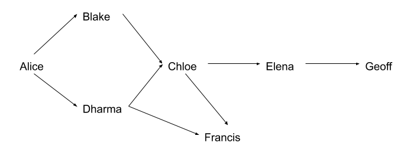

--- 
title: "Hands-on Guide to PGP"
---

# Introduction to PGP
This document aims to be a gentle introduction to PGP. 
The text of next section is taken from the post [OpenPGP, PGP and GnuPG: What is the difference?](https://www.goanywhere.com/blog/2013/07/18/openpgp-pgp-gpg-difference).
The rest of the document heavily relies on [The GNU Privacy Handbook](https://www.gnupg.org/gph/en/manual.html).

## Differences among OpenPGP, PGP and GnuPG

### PGP (Pretty Good Privacy)
* The company, PGP Inc., owned the rights to the original PGP encryption software.
* This software was developed by Phil Zimmermann & Associates, LLC and released in 1991 to ensure the security of files that were posted on pre-internet bulletin boards.
* From 1997 until 2010, the software changed hands several times until it was acquired by Symantec Corp., who continues to develop the PGP brand.

### OpenPGP
* Zimmerman, one of the original PGP developers, soon began to work on an open-source version of PGP encryption that employed encryption algorithms that had no licensing issues.
* In 1997 he submitted an open-source PGP (OpenPGP) standards proposal to the IETF (Internet Engineering Task Force), to allow PGP standards-compliant encryption vendors to provide solutions that were compatible with other OpenPGP-compliant software vendors.
* This strategy created an open and competitive environment for PGP encryption tools to thrive.
* Today, OpenPGP is a standard of PGP that is open-source for public use, and the term can be used to describe any program that supports the OpenPGP system.

### GnuPG (GNU Privacy Guard)
* GnuPG was developed by Werner Koch and released in 1999 as an alternative to what is now Symantec's software suite of encryption tools.
* It is available as a free software download, and is based on the OpenPGP standards established by the IETF so that it would be interoperable with Symantec's PGP tools as well as OpenPGP standards.
* Therefore, GnuPG can open and unencrypt any PGP and OpenPGP standards file.

### Summary
* OpenPGP is the IETF-approved standard that describes encryption technologies that use processes that are interoperable with PGP.
* PGP is a proprietary encryption solution, and the rights to its software are owned by Symantec.
* GnuPG is another popular solution that follows the OpenPGP standards to provide an interface for end users to easily encrypt their files.

## Symmetric encryption with PGP

* You can use a symmetric cipher to encrypt a document.
* The key is derived from a passphrase supplied when the document is encrypted.
* Symmetric encryption is normally used for securing documents when the passphrase does not need to be communicated to others.

A document can be encrypted with a symmetric cipher by using the `--symmetric` option.

```
> gpg --output doc.gpg --symmetric doc.txt
Enter passphrase: <PASSPHRASE GOES HERE>
```

Note: PGP does note delete the original file (`doc.txt`) which must be explicitly deleted if you wish so.

To recover the original file you can decrypt it by using PGP:

```
> gpg --output doc.txt --decrypt doc.gpg
Enter passphrase: <PASSPHRASE GOES HERE>
```
### Exercise
1. Create a file named `secret-message.txt` in your home directory and write the string "All work and no play makes Jack a dull boy.".
2. Encrypt the file `secret-message.txt` using "Il mattino ha l'oro in bocca." as a passphase.  The encrypted message should be stored in the file `secret-message.enc` in your home directory.
3. Delete del file `secret-message.txt` from your home directory.


## Public-key encryption with PGP

### Generating a new keypair

The command-line option `--gen-key` is used to create a new primary keypair.

```
> gpg --gen-key
gpg (GnuPG) 1.4.20; Copyright (C) 2015 Free Software Foundation, Inc.
This is free software: you are free to change and redistribute it.
There is NO WARRANTY, to the extent permitted by law.

Please select what kind of key you want:
   (1) RSA and RSA (default)
   (2) DSA and Elgamal
   (3) DSA (sign only)
   (4) RSA (sign only)
Your selection? 
```

GnuPG is able to create several different types of keypairs, but a primary key must be capable of making signatures:

- Option 1 creates two RSA keypairs: a primary keypair used for making signatures and a subordinate keypair for encryption.
- Option 2 creates a DSA keypair: the primary keypair usable only for making signatures and an ElGamal subordinate keypair for encryption.
- Option 3 creates only a DSA keypair for making signatures only.
- Option 3 creates only a RSA keypair for making signatures only.

In all cases it is possible to later add additional subkeys for encryption and signing. For most users the default option is fine.

You must also choose a key size, the lifetime of the key (a key that does not expire is adequate for most users), a user ID (Real Name, Comment and Email Address).

Finally GnuPG needs a passphrase to protect the primary and subordinate private keys that you keep in your possession.

* There is no limit on the length of a passphrase, and it should be carefully chosen.
* From the perspective of security, the passphrase to unlock the private key is one of the weakest points in GnuPGP.
* Ideally, the passphrase should not use words from a dictionary and should mix the case of alphabetic characters as well as use non-alphabetic characters.


### Exchanging keys

To communicate with others you must exchange public keys.

To list the keys on your public keyring use the command-line option `--list-keys`.

```
> gpg --list-keys
/home/armando/.gnupg/pubring.gpg
---------------------------------------
pub   1024R/4E1E1D8A 2017-10-14
uid                  Mario Rossi <mario.rossi@gmail.com>
sub   1024R/AFB311B5 2017-10-14
```

### Exporting a public key

* To send your public key to a correspondent you must first export it.
* The command-line option `--export` is used to do this.
* It takes an additional argument identifying the public key to export.
* Either the key ID or any part of the user ID may be used to identify the key to export.

```
> gpg --armor --export mario.rossi@gmail.com
-----BEGIN PGP PUBLIC KEY BLOCK-----
Version: GnuPG v1

mI0EWeIoYgEEANtnr1fQoGvY4W6A2yIn1TNJgLpIkrL/5vJ70t9c8KiEUTjzxAkj
1yBQ9S2qQLvKfpUAK0Qq6Z+Y5Zyorw200O0oexKwXGTJRaNmIQOHdHvqM4CVRMv3
bJDMmdH64WLwY3XYvZW9kzQA6NlP1+DgNjG3ebWtm8bBOLG4LMxY7Hu3ABEBAAG0
I01hcmlvIFJvc3NpIDxtYXJpby5yb3NzaUBnbWFpbC5jb20+iLgEEwECACIFAlni
KGICGwMGCwkIBwMCBhUIAgkKCwQWAgMBAh4BAheAAAoJEKWjdw1OHh2KPugEAMLo
/F8eH8emFQ0xFFLaBzFpJWTPKO1RpCGl1QzIXEkwtpYPKenT5ruXKBcORansl8uG
UUCKsIFqEmsm5YtLQ4ruGhGg24mxrnP6ZBvmqWZNF8b5TJtdaYjJLl05NNK1C6BV
zrsupVT7SlvvsPCVTL9NDT7rxrDGcxBueB233X6vuI0EWeIoYgEEALJaxcM7EEVp
alLz3oiwnmlPtnmcYloDhh3cbn74HpV/ldrrS8JeYHdJ5yjvefek24V4r+7Gxn3J
tBgL9cuqrez8EzkvuGjaIiyyIZHLTJju86DZcTPcODCwWKePjb1DcJ2OOHuaN6s4
2nGOzH6Ia7UWRHeQhdLAHM0ersNReeCVABEBAAGInwQYAQIACQUCWeIoYgIbDAAK
CRClo3cNTh4diveqBACX9hllxteGdZW3+jQl9chlXu3M/eQaAtbcjvSergcYq9S5
f6FGQCOALPDCj15NWUCEFoHCfPji1+JKO1sAfhzmpo9XqA11m63s4gEDCaB/Qn93
mPno4fF7SENw+CNZ7nniEvKhuzBG92AvaiHYG1eHAwtXnIYUAhb+SR0JSP6KAQ==
=AWyM
-----END PGP PUBLIC KEY BLOCK-----
```

### Exercise
1. You must create a new key pair for personal use. Use your real name and a valid email address when asked to do so by GnuPG.
2. Choose your own passphrase to protect the private key and do not share it with anyone else!
3. Export the public key and save it to a file named `*matricola*.puk` in you home directory, where \*matricola\* is your UNIGE id number.

### Importing a public key

A public key may be added to your public keyring with the `--import` option. (In the sequel we  write `user> command` to indicate that `command` is executed by `user`.)

```
alice> gpg --import blake.gpg
gpg: key 9E98BC16: public key imported
gpg: Total number processed: 1
gpg:               imported: 1
```

```
alice> gpg --list-keys
/users/alice/.gnupg/pubring.gpg
---------------------------------------
pub  1024D/BB7576AC 1999-06-04 Alice (Judge) <alice@cyb.org>
sub  1024g/78E9A8FA 1999-06-04

pub  1024D/9E98BC16 1999-06-04 Blake (Executioner) <blake@cyb.org>
sub  1024g/5C8CBD41 1999-06-04
```

* Once a key is imported it should be validated.
* PGP uses a powerful and flexible trust model that does not require you to personally validate each key you import.
* Some keys may need to be personally validated, however.
* A key is validated by verifying the key's fingerprint.
* You can even certify the validity of the key by signing it.

```
alice> gpg --edit-key blake@cyb.org
pub  1024D/9E98BC16  created: 1999-06-04 expires: never      trust: -/q
sub  1024g/5C8CBD41  created: 1999-06-04 expires: never     
(1)  Blake (Executioner) <blake@cyb.org>

Command> fpr
pub  1024D/9E98BC16 1999-06-04 Blake (Executioner) <blake@cyb.org>
             Fingerprint: 268F 448F CCD7 AF34 183E  52D8 9BDE 1A08 9E98 BC16
```

* A key's fingerprint is verified with the key's owner through a *secure* channel.
* This may be done in person or over the phone or through any other means as long as you can guarantee that you are communicating with the key's true owner.
* If the fingerprint you get is the same as the fingerprint the key's owner gets, then you can be sure that you have a correct copy of the key.

* After checking the fingerprint, you may sign the key to validate it.
* Since key verification is a weak point in public-key cryptography, you should be extremely careful and always check a key's fingerprint with the owner before signing the key.

```
Command> sign
             
pub  1024D/9E98BC16  created: 1999-06-04 expires: never      trust: -/q
             Fingerprint: 268F 448F CCD7 AF34 183E  52D8 9BDE 1A08 9E98 BC16

     Blake (Executioner) <blake@cyb.org>

Are you really sure that you want to sign this key
with your key: "Alice (Judge) <alice@cyb.org>"

Really sign?
```

* Once signed you can check the key to list the signatures on it and see the signature that you have added.
* Every user ID on the key will have one or more self-signatures as well as a signature for each user that has validated the key.

```
Command> check
uid  Blake (Executioner) <blake@cyb.org>
sig!       9E98BC16 1999-06-04   [self-signature]
sig!       BB7576AC 1999-06-04   Alice (Judge) <alice@cyb.org>
```


### Listing Key Signatures

The command-line option `--list-sigs` is like to `--list-keys` but it additionally displays also the key signatures.

```
> gpg --list-sigs
/home/armando/.gnupg/pubring.gpg
---------------------------------------
pub   rsa3072 2019-11-17 [SC] [expires: 2021-11-16]
      81B88ACDB1F4A829CDDE48E633F0887D7F248E41
uid           [ultimate] Mario Rossi <mario.rossi@gmail.com>
sig 3        33F0887D7F248E41 2019-11-17  Mario Rossi <mario.rossi@gmail.com>
sig          2E962779B10A1CD0 2019-11-17  Elena Verdi <elena.verdi@gmail.com>
sub   rsa3072 2019-11-17 [E] [expires: 2021-11-16]
sig          33F0887D7F248E41 2019-11-17  Mario Rossi <mario.rossi@gmail.com>
```

In this case, there are two signatures: one generated by Mario Rossi (self-signed) and one by Elena Verdi.


### Web of Trust

Validating a correspondent's key by personally checking his key's fingerprint is ok but requires a secure channel to obtain the fingerprint.

In the web of trust model, responsibility for validating public keys is delegated to people you trust. For example, suppose

* Alice has signed Blake's key, and
* Blake has signed Chloe's key and Dharma's key.

If Alice trusts Blake to properly validate keys that he signs, then Alice can infer that Chloe's and Dharma's keys are valid without having to personally check them. She simply uses her validated copy of Blake's public key to check that Blake's signatures on Chloe's and Dharma's are good. 

In practice trust is subjective. For example, Blake's key is valid to Alice since she signed it, but she may not trust Blake to properly validate keys that he signs. In that case, she would not take Chloe's and Dharma's key as valid based on Blake's signatures alone. 

The web of trust model accounts for this by associating with each public key on your keyring an indication of how much you trust the key's owner. There are four trust levels.

* *unknown* Nothing is known about the owner's judgment in key signing. Keys on your public keyring that you do not own initially have this trust level.

* *none* The owner is known to improperly sign other keys.

* *marginal* The owner understands the implications of key signing and properly validates keys before signing them.

* *full* The owner has an excellent understanding of key signing, and his signature on a key would be as good as your own.

A key's trust level is something that you alone assign to the key, and it is considered *private* information. It is not packaged with the key when it is exported; it is even stored separately from your keyrings in a separate database.

The GnuPG key editor may be used to adjust your trust in a key's owner. The command is trust. In this example Alice edits her trust in Blake and then updates the trust database to recompute which keys are valid based on her new trust in Blake.

```
alice% gpg --edit-key blake

pub  1024D/8B927C8A  created: 1999-07-02 expires: never      trust: q/f
sub  1024g/C19EA233  created: 1999-07-02 expires: never
(1)  Blake (Executioner) <blake@cyb.org>

Command> trust
pub  1024D/8B927C8A  created: 1999-07-02 expires: never      trust: q/f
sub  1024g/C19EA233  created: 1999-07-02 expires: never
(1)  Blake (Executioner) <blake@cyb.org>

Please decide how far you trust this user to correctly
verify other users' keys (by looking at passports,
checking fingerprints from different sources...)?

 1 = Don't know
 2 = I do NOT trust
 3 = I trust marginally
 4 = I trust fully
 s = please show me more information
 m = back to the main menu

Your decision? 3

pub  1024D/8B927C8A  created: 1999-07-02 expires: never      trust: m/f
sub  1024g/C19EA233  created: 1999-07-02 expires: never
(1)  Blake (Executioner) <blake@cyb.org>

Command> quit
[...]
```

Trust in the key's owner and the key's validity are indicated to the right when the key is displayed. Trust in the owner is displayed first and the key's validity is second[4]. The four trust/validity levels are abbreviated: unknown (q), none (n), marginal (m), and full (f). In this case, Blake's key is fully valid since Alice signed it herself. She initially has an unknown trust in Blake to properly sign other keys but decides to trust him marginally.

The web of trust allows a more elaborate algorithm to be used to validate a key. Formerly, a key was considered valid only if you signed it personally. A more flexible algorithm can now be used: a key K is considered valid if it meets two conditions:

1. it is signed by enough valid keys, meaning
 * you have signed it personally,
 * it has been signed by one fully trusted key, or
 * it has been signed by three marginally trusted keys; and
2. the path of signed keys leading from K back to your own key is five steps or shorter.

The path length, number of marginally trusted keys required, and number of fully trusted keys required may be adjusted. The numbers given above are the default values used by GnuPG.


The following DAG and table show a web of trust rooted at Alice. 

<!--  -->


case | marginal trust        | full trust            | marginal validity | full validity
 --- | --------------------- | --------------------- | ----------------- | -----------------------------
1    |                       | Dharma                |                   | Blake, Chloe, Dharma, Francis
2    | Blake, Dharma         |                       | Francis           | Blake, Chloe, Dharma
3    | Chloe, Dharma         |                       | Chloe, Francis    | Blake, Dharma
4    | Blake, Chloe, Dharma  |                       | Elena             | Blake, Chloe, Dharma, Francis
5    |                       | Blake, Chloe, Elena   |                   | Blake, Chloe, Dharma, Elena, Francis


The graph illustrates who has signed who's keys. The table shows which keys Alice considers valid based on her trust in the other members of the web. This example assumes that two marginally-trusted keys or one fully-trusted key is needed to validate another key. The maximum path length is three.

When computing valid keys in the example, Blake and Dharma's are always considered fully valid since they were signed directly by Alice. The validity of the other keys depends on trust. 

* In the first case, Dharma is trusted fully, which implies that Chloe's and Francis's keys will be considered valid. 
* In the second example, Blake and Dharma are trusted marginally. Since two marginally trusted keys are needed to fully validate a key, Chloe's key will be considered fully valid, but Francis's key will be considered only marginally valid. 
* In the case where Chloe and Dharma are marginally trusted, Chloe's key will be marginally valid since Dharma's key is fully valid. Francis's key, however, will also be considered marginally valid since only a fully valid key can be used to validate other keys, and Dharma's key is the only fully valid key that has been used to sign Francis's key. When marginal trust in Blake is added, Chloe's key becomes fully valid and can then be used to fully validate Francis's key and marginally validate Elena's key. 
* Lastly, when Blake, Chloe, and Elena are fully trusted, this is still insufficient to validate Geoff's key since the maximum certification path is three, but the path length from Geoff back to Alice is four.

The web of trust model is a flexible approach to the problem of safe public key exchange. It permits you to tune GnuPG to reflect how you use it. At one extreme you may insist on multiple, short paths from your key to another key K in order to trust it. On the other hand, you may be satisfied with longer paths and perhaps as little as one path from your key to the other key K. Requiring multiple, short paths is a strong guarantee that K belongs to whom your think it does. The price, of course, is that it is more difficult to validate keys since you must personally sign more keys than if you accepted fewer and longer paths.


### Encrypting and decrypting documents

To encrypt a message the option `--encrypt` is used.
```
alice> gpg --output doc.gpg --encrypt --recipient blake@cyb.org doc
```
* The `--recipient` option is used once for each recipient and takes an extra argument specifying the public key to which the document should be encrypted.
* The encrypted document can only be decrypted by someone with a private key that complements one of the recipients' public keys.
* Note: you cannot decrypt a document encrypted by you unless you included your own public key in the recipient list.

To decrypt a message the option `--decrypt` is used.
* You need the private key to which the message was encrypted. 

```
blake> gpg --output doc --decrypt doc.gpg

You need a passphrase to unlock the secret key for
user: "Blake (Executioner) <blake@cyb.org>"
1024-bit ELG-E key, ID 5C8CBD41, created 1999-06-04 (main key ID 9E98BC16)
```

### Making and verifying signatures

* A digital signature certifies and timestamps a document. If the document is subsequently modified in any way, a verification of the signature will fail. 
* A signature is created using the private key of the signer. The signature is verified using the corresponding public key. 
* The command-line option `--sign` is used to make a digital signature. The document to sign is input, and the signed document is output.

```
alice> gpg --output doc.sig --sign doc

You need a passphrase to unlock the private key for
user: "Alice (Judge) <alice@cyb.org>"
1024-bit DSA key, ID BB7576AC, created 1999-06-04

Enter passphrase: 
```

* The document is compressed before being signed, and the output is in binary format.
* Given a signed document, you can either check the signature or check the signature and recover the original document.
* To check the signature use the `--verify` option.
* To verify the signature and extract the document use the `--decrypt` option.
* The signed document to verify and recover is input and the recovered document is output.

```
blake> gpg --output doc --decrypt doc.sig
gpg: Signature made Fri Jun  4 12:02:38 1999 CDT using DSA key ID BB7576AC
gpg: Good signature from "Alice (Judge) <alice@cyb.org>"
```

### Clearsigned documents

* A common use of digital signatures is to sign email messages.
* In such situations it is undesirable to compress the document while signing it.
* The option `--clearsign` causes the document to be wrapped in an ASCII-armored signature but otherwise does not modify the document.

```
alice> gpg --clearsign doc

You need a passphrase to unlock the secret key for
user: "Alice (Judge) <alice@cyb.org>"
1024-bit DSA key, ID BB7576AC, created 1999-06-04

-----BEGIN PGP SIGNED MESSAGE-----
Hash: SHA1

[...]
-----BEGIN PGP SIGNATURE-----
Version: GnuPG v0.9.7 (GNU/Linux)
Comment: For info see http://www.gnupg.org

iEYEARECAAYFAjdYCQoACgkQJ9S6ULt1dqz6IwCfQ7wP6i/i8HhbcOSKF4ELyQB1
oCoAoOuqpRqEzr4kOkQqHRLE/b8/Rw2k
=y6kj
-----END PGP SIGNATURE-----
```

### Detached signatures

A detached signature is created using the `--detach-sig` option.
```
alice> gpg --output doc.sig --detach-sig doc

You need a passphrase to unlock the secret key for
user: "Alice (Judge) <alice@cyb.org>"
1024-bit DSA key, ID BB7576AC, created 1999-06-04

Enter passphrase: 
Both the document and detached signature are needed to verify the signature. The --verify option can be to check the signature.

blake> gpg --verify doc.sig doc
gpg: Signature made Fri Jun  4 12:38:46 1999 CDT using DSA key ID BB7576AC
gpg: Good signature from "Alice (Judge) <alice@cyb.org>"
```

